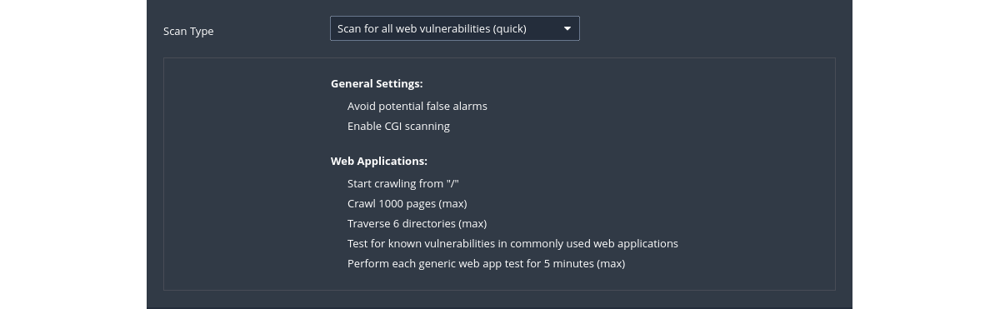

# Web application scan

|  |
|:--:|
| Scan for published and unknown web vulnerabilities. |

## Default config

|  |
|:--:|
| [Scan And Policy Templates: Vulnerabilities](https://docs.tenable.com/nessus/10_4/Content/ScanAndPolicyTemplates.htm#Vulnerabilities) |

## Settings

Assessment is where and how the type of vulnerability scan to do is set. Nessus will check susceptibility of 
Web applications to attacks and other systems to brute-force attacks as well. This setting has sections allowing 
customisation of general scans to Windows, SCADA, Web applications, and even brute-force checks.

## Example scan

1. Select target
2. Select plugins 
   * CGI abuses - This plugin family checks for anything that is ‘CGI’ related, unless it is XSS (and only a XSS vulnerability), in which case it falls into the "CGI abuses : XSS" family. These checks use a combination of detection techniques, including checking version of the application and testing for the actual vulnerability. The attacks include software detection, information disclosure, XSS, SQLi, LFI, RFI, overflows and more.
   * CGI abuses : XSS - Specific CGI checks for reflective and persistent XSS vulnerabilities in common web applications.
   * Web servers - Plugins in this family detect approximately 1531 specific vulnerabilities in popular web servers, such as Apache, IIS and generic vulnerabilities associated with the HTTP protocol itself.
3. Launch scan
4. Confirm found vulnerabilities by running other vulnerability scanners against the targets to eliminate the possibility of any false positives.
