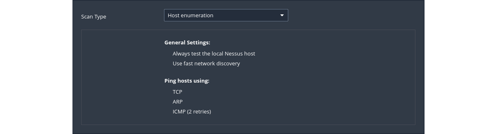

# Host discovery

|  |
|:--:|
| Performs a simple scan to discover live hosts and open ports. |

## Default config

|  |
|:--:|
| [Scan And Policy Templates: Discovery](https://docs.tenable.com/nessus/10_4/Content/ScanAndPolicyTemplates.htm#Discovery) |

## Scan

1. [Discovery Scan Settings](https://docs.tenable.com/nessus/Content/DiscoverySettings.htm) is where the ports to be 
scanned and the methods to be used in the discovery are set.
2. Launch scan
3. Confirm found vulnerabilities by running other vulnerability scanners against the targets to eliminate the possibility of any false positives.

