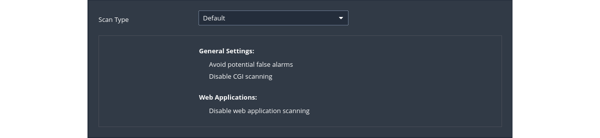

# Basic network scan

|  |
|:--:|
| Performs a full system scan that is suitable for any host. For example, this template can be used for   an internal vulnerability scan on an organisation's systems. |

## Default config

|  |
|:--:|
| [Scan And Policy Templates: Vulnerabilities](https://docs.tenable.com/nessus/10_4/Content/ScanAndPolicyTemplates.htm#Vulnerabilities) |

## Example scan

1. Under `DISCOVERY` (on the left) set the `Scan Type` to cover ports `1-65535`
2. In `ADVANCED` change `Scan Type` to `Scan low bandwidth links`
3. Launch scan
4. Confirm found vulnerabilities by running other vulnerability scanners against the targets to eliminate the possibility of any false positives.

