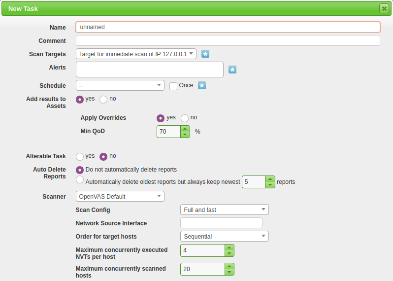
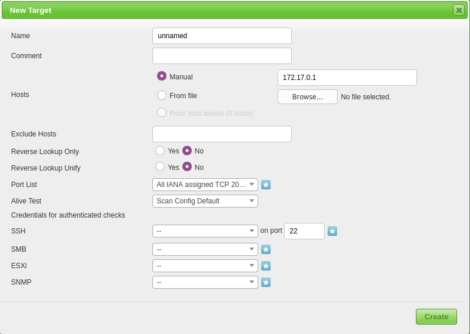

# Scanning infrastructure

## Create task

To create a configurable task navigate to the star icon in the upper right-hand corner of the Tasks dashboard and select New Task:

| 
|:--:|
| When selecting New Task from the dropdown a large pop-up with many options appears. |

* Name: Setting the name the scan will be known as inside of OpenVAS
* Scan Targets: The targets to scan, can include Hosts, Ports, and Credentials.
* Scanner: The scanner to use. Default is the OpenVAS architecture.
* Scan Config: OpenVAS has seven different scan types.

## Scoping a new target

To scope a new target, navigate to the star icon next to Scan Targets.

| 
|:--:|
| The two main options to configure are the Name and the Hosts. |

Continue creating the task and begin the scan.

## Launch

After the task is created you will be brought back to the scan dashboard where you can monitor and start the task. 
To start the task navigate to the start icon under Actions.