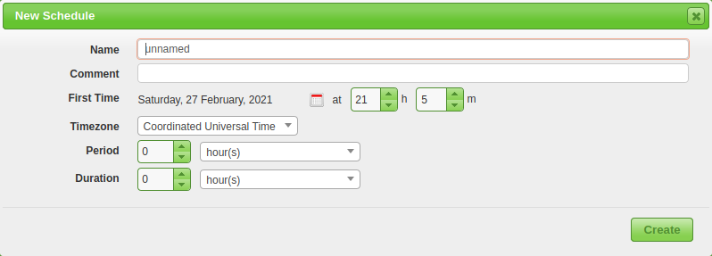
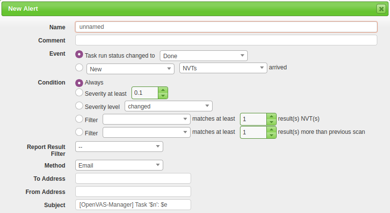

# Reporting and continuous monitoring

## The report

The automated report from OpenVAS begins with some basic host and task information including Host, Start, End, and 
Vulnerability categories. It will also check for host authentications and an overall summary of open ports on the host.

## Continuous monitoring

OpenVAS offers many options for continuous and scheduled monitoring/vulnerability management. If you work in a team 
or a pipeline this can allow you to efficiently and quickly optimize your current solutions. Examples of continuous 
vulnerability scanning utilities are Alerts, Schedules, and Agents.

## Creating schedules

To begin creating a schedule navigate to Configuration -> Schedules and click on the blue star icon in the upper 
left-hand corner. 

| 
|:--:|
| Fill out the basic information like Name, First Start Time, Period, etc. |

Once you have the schedule created you can now create a new Task/Scan with this created schedule attached.

## Crafting alerts

The process for creating alerts is similar to creating a schedule, navigate to Configuration -> Alerts and click 
on the blue star icon in the upper left-hand corner. 

| 
|:--:|
| The main options are Name, Event, Condition, and To Address. |

The event can be configured to alert based on the status of the scan or when a new NVT/vulnerability is detected. 
The condition option will make sure that your inbox isn't flooded with alerts, this can be changed based on severity 
or filters. The To Address is fairly self-explanatory and will send an email of the alert to the specified mail 
address. Once created you will again need to connect the alert to a new Task/Scan.