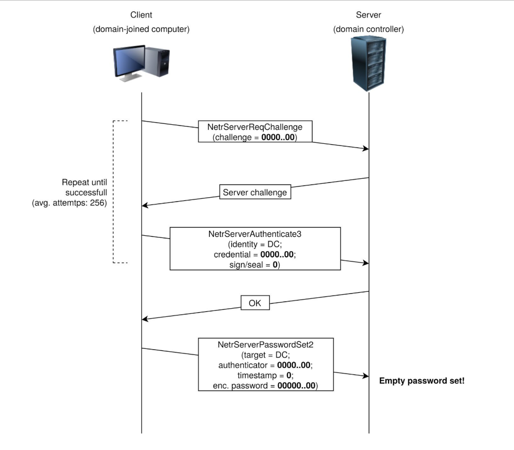

# Zerologon

|  |
|:--:|
| [https://tryhackme.com/room/zer0logon](https://tryhackme.com/room/zer0logon) |

On September 14, Secura released a whitepaper for CVE-2020-1472, that allowed an attacker to go from Zero to Domain 
Admin in approximately one minute. They dubbed this vulnerability Zero Logon.

Zero Logon is a purely statistics based attack that abuses a feature within MS-NRPC (Microsoft NetLogon Remote 
Protocol), MS-NRPC is a critical authentication component of Active Directory that handles authentication for User 
and Machine accounts. In short -- the attack mainly focuses on a poor implementation of Cryptography. To be more 
specific, Microsoft chose to use AES-CFB8 for a function called ComputeNetlogonCredential, which is normally fine, 
except they had hard coded the Initialization Vector to use all zeros instead of a random string. When an attacker 
sends a message only containing zeros with the IV of zero, there is a 1-in-256 chance that the Ciphertext will be Zero.

|  |
|:--:|
| Simplified Netlogon authentication handshake |

|  |
|:--:|
| The Zerologon attack, which effectively boils down to filling particular message parameters with  zeroes and retrying the handshake a few times in order to set an empty computer password on the DC. |

In this room, the ZeroLogon vulnerability is approached from a "Proof of Concept" (PoC) emphasis, providing a 
breakdown of the vulnerable method within this issue. TryHackMe does not condone illegal actions taken on the part of 
an individual (or group).

## Tools

### Impacket

Install Impacket if not already installed:

    python3 -m pip install virtualenv
    python3 -m virtualenv impacketEnv
    source impacketEnv/bin/activate
    pip install git+https://github.com/SecureAuthCorp/impacket

### PoC

Get the PoC file:

    wget https://raw.githubusercontent.com/SecuraBV/CVE-2020-1472/master/zerologon_tester.py

### Exploit

Get the correct python script:

    wget https://raw.githubusercontent.com/Sq00ky/Zero-Logon-Exploit/master/zeroLogon-NullPass.py

## Scan

    nmap -sC -sV <target IP>

## Resources

* [Secura Zerologon CVE-2020-1472 Whitepaper](https://www.secura.com/blog/zero-logon)
* [Microsoft Open Specifications 3.1.4.1 Session-Key Negotiation](https://docs.microsoft.com/en-us/openspecs/windows_protocols/ms-nrpc/7b9e31d1-670e-4fc5-ad54-9ffff50755f9)
* [Microsoft Open Specifications 3.5.4.4.2 NetrServerAuthenticate3 (Opnum 26)](https://docs.microsoft.com/en-us/openspecs/windows_protocols/ms-nrpc/3a9ed16f-8014-45ae-80af-c0ecb06e2db9)